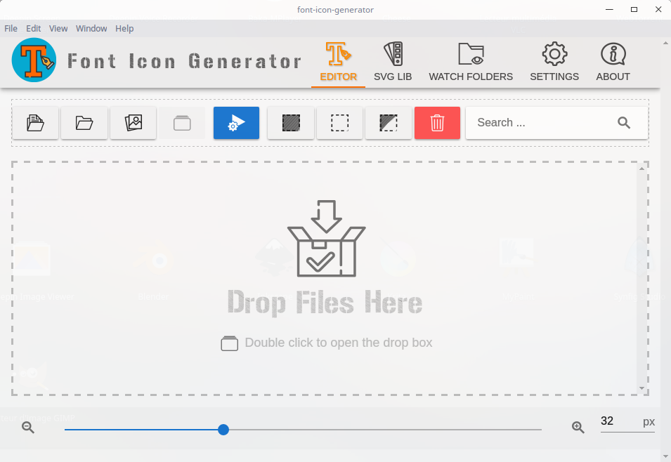

#  Font Icon Generator
font icon genrator is an offline cross platforme application to convert svg to font face web icons. it is free to use for commercial and non commercial use 

*the licence may change to free open source soon*

### This is a beta test version it may not be stable an not full featured a better version will be relese as soon as possible

## download

* [windows](https://github.com/kyranis-studio/font-icon-generator/releases/download/0.0.1-beta/Font.Icon.Generator.0.0.1-Beta.exe)
* [linux](https://github.com/kyranis-studio/font-icon-generator/releases/download/0.0.1-beta/font-icon-generator.sh)
### for linux because of the limit of open file (run ulimit -a to know the limit of open files ) the applicaton may freeze so don't add more then 1024 icons this problem will be fix in the next version
### if the svg lib freeze delete the folder /home/youUserName/.font icon generator/svg-lib
* macos

